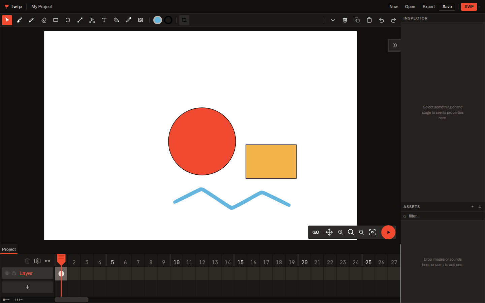

# twip

> A modern Flash. Draw vector shapes on a timeline, tween them, press export, and get an honest-to-god `.swf` that [Ruffle](https://ruffle.rs) plays.

A personal nostalgia project — not a product. Flash is gone, its editor is abandonware, and the thing it did well — drawing and animating vectors and shipping them as a small file that just plays — has no clean modern replacement. twip is an attempt to get that feeling back without pretending Flash never had problems.



It runs in a browser tab at **[twip.ink](https://twip.ink)** — the editor, the compiler built
to wasm, and Ruffle, all in the page. No account, no upload, no server side: the `.wick` and
the `.swf` are made in the tab and stay on your machine.

## How it works

- **Two files, and only one of them is yours to keep.** You save a `.wick` document — a zip of paper.js paths and a timeline, the format the editor already spoke. Export compiles it to real SWF. The document is the source; the `.swf` is the artifact, and twip will build it again from the same input any time.
- **One truth renderer, and it's Ruffle.** Anything that plays — preview, test, export — is Ruffle rendering compiled SWF. No second renderer to disagree with the first.
- **The editor is a fork of the [Wick Editor](https://github.com/Wicklets/wick-editor)**, vendored at [`editor/`](editor/). Reusing a battle-tested drawing and timeline UI, with a real SWF export and a Ruffle preview added. The one thing no Wick fork has is playable SWF out.
- **Draw at 12fps, play back at 60.** New projects start at Flash's own 12, because a fifth as many drawings is the reason to hand-draw at all. The compiler resamples on export: each document frame becomes as many movie frames as fit in 60, and a tween is re-evaluated at each one rather than held. A cel still holds for its five frames — the flipbook look survives — while anything moving continuously gets every refresh the display has. `--no-upsample` turns it off.

## Layout

| | |
|---|---|
| `src/`, `tests/`, `fixtures/` | the compiler — a Rust crate and CLI that turn `.wick` into `.swf` |
| `editor/` | the editor fork (its own README and BUILD.md) |
| `scripts/`, `docs/` | the golden-oracle setup script, and the notes worth keeping |

```
cargo run --bin twip -- fixtures/test1.wick out.swf      # from a clone
cargo run --bin twip -- --no-upsample in.wick out.swf    # one movie frame per document frame
cargo run --bin twip -- import old.swf art.svg           # recover the artwork from an SWF
cargo run --bin twip -- import --frame 3 old.swf art.svg # ...as it looked at one frame
cargo install --git https://github.com/justinstimatze/twip
```

`import` goes the other way, and only part of the way: it recovers **artwork**, as an SVG you
drag onto the editor canvas, positioned on the stage as the movie placed it. Timing, tween
keys, easing, layers and scripts do not come back and are not guessed at — a tween is a matrix
per frame by the time it reaches the file, and inferring the curve back out of those matrices
produces a confident wrong answer rather than no answer.

By default you get every drawing the movie ever places, at once, which is what an animation
wants — Ruffle's logo introduces 18 of its 22 shapes after frame 1. `--frame N` gives you one
moment as a player would show it, which is what a movie that changes over time wants instead.

It reads real Flash, not just twip's own output: across ruffle's regression corpus of 4,898
SWFs, 4,891 open and the seven that don't are deliberately malformed. Late AS3 content often
has nothing to recover — it draws through the graphics API at runtime, so there are no shapes
in the file. For gradients, bitmaps, text and fonts, which twip has no reader for, decompile
with [FFDec](https://github.com/jindrapetrik/jpexs-decompiler) first.

There is no crates.io release. The compiler depends on ruffle's `swf` crate pinned to one
revision, crates.io rejects git dependencies, and the published `swf` 0.2.2 is an
18-month-stale package wearing the same version number as the one this needs. `--git` is the
route.

## Status

The compiler handles what the fixtures exercise: filled and stroked paths, layer ordering, frame-by-frame timelines, nested clips as sprites, motion tweens with every easing curve the Wick engine ships, skew, brush shapes planarized so their holes survive, and `stop`/`play`/`gotoAndPlay`/`gotoAndStop` compiled to AVM1 — as frame actions and as click handlers. Gradients, text, audio, filters and images are out of scope for now.

Five test layers back it: a structural oracle that parses the emitted SWF and asserts tags, depths and per-frame matrices; a round-trip oracle that replays the emitted display list over every fixture in both compile modes and checks it against the document's own frame numbers; golden PNGs rendered through Ruffle's own exporter on lavapipe; the editor's own browser checks; and a check that compiles a fixture in a real browser tab and requires the bytes to match the CLI's exactly. All of them run in CI.

Export works three ways, and the editor picks whichever exists: an in-process Rust call under the desktop build, the same compiler as wasm in a plain browser tab, or a local dev bridge.

## Reading further

| | |
|---|---|
| [`editor/BUILD.md`](editor/BUILD.md) | building and running the editor, and the three export routes |
| [`docs/wick-format.md`](docs/wick-format.md) | what a `.wick` file contains and what it takes to compile one — there is no spec, so this is it |
| [`docs/testing.md`](docs/testing.md) | the five test layers, and why there is no editor-versus-player pixel diff |
| [`docs/ui-research.md`](docs/ui-research.md) | the survey of post-Flash tools the interface was designed against |

## Rough edges

Named here rather than left for you to trip over. The interface is mid-redesign: every tab in `TabbedInterface` carries a bottom rule, so the active one is set apart by colour alone and the inactive ones still read a little like links. The Inspector's rows use the inherited 30/70 label-to-field split, which is generous at 250px and wrong at 400.

The compiler skips gradients, text, audio, filters and images rather than guessing at them — see Status above. Everything else the editor can draw, it compiles.

## Credit

twip's editor is **built on the [Wick Editor](https://github.com/Wicklets/wick-editor) by Wicklets LLC**, via [StickmanRed's fork](https://github.com/StickmanRed/wick-editor). The drawing engine, the document model, the tween engine and the timeline are theirs; see [`editor/CREDITS.md`](editor/CREDITS.md) for the people who wrote them. twip is not affiliated with or endorsed by either project.

## License

Two licenses, because the tree holds two things.

- The compiler — everything outside `editor/` — is **MIT**, and ships no Wick code. See [`LICENSE`](LICENSE).
- The editor fork at `editor/` is **GPLv3**, because it contains Wick's code. See [`editor/LICENSE.md`](editor/LICENSE.md).

MIT is GPL-compatible, so there is no conflict in having both here. A desktop build links the compiler into the same binary as the editor and is conveyed under GPLv3; the compiler crate on its own stays MIT and can be taken and used as such.

[`LICENSING.md`](LICENSING.md) says which is which in detail, including what GPLv3 §6 requires before a packaged build can be handed to anyone. I am not a lawyer; read the licenses rather than my summary of them.
